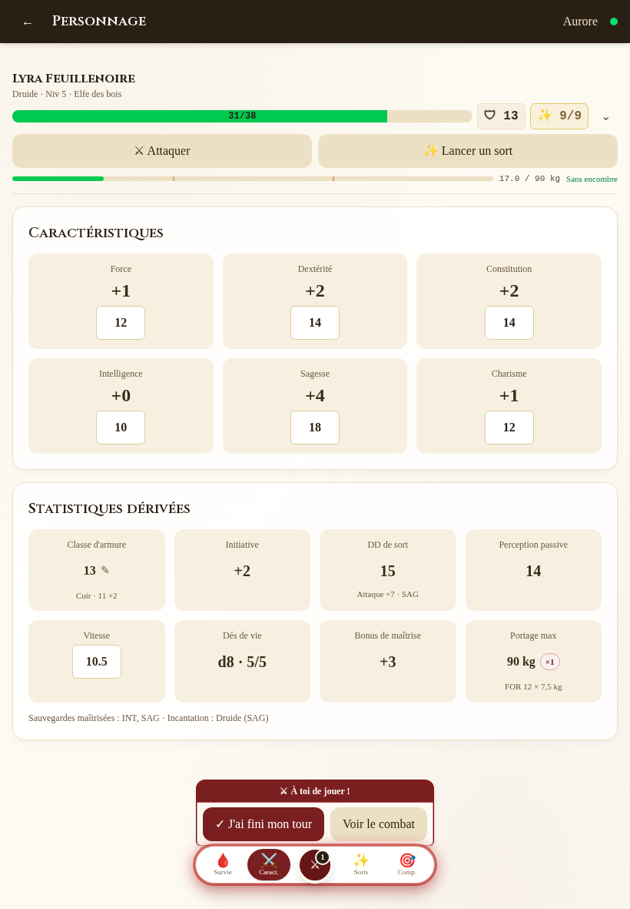

<div align="center">


# Table Sync

**Le compagnon de campagne partagé, pour le MD et les joueurs.**

[](https://github.com/WazoAkaRapace/table-sync/actions/workflows/ci-test.yml)
[🌐 Site de présentation](https://wazoakarapace.github.io/table-sync/)

</div>

Application web mobile-first de fiche de personnage, d'inventaire et de combat pour D&D 5e. Entièrement en français, poids en kilogrammes, moteur de règles SRD 5.1 complet — et une synchronisation temps réel : chaque joueur sur son écran, le MD sur le sien, tout le monde voit la même partie. Pensée pour la table (PWA installable, téléphone et tablette).

La fiche de personnage — ici sur tablette, avec le dock de navigation et l'indicateur « À toi de jouer ! » :



## Fonctionnalités

- **Fiche de personnage** — PV, dés de vie, états avec durées, épuisement, concentration, repos court/long, ressources de classe, forme sauvage du Druide
- **Moteur de règles SRD 5.1** — CA, armes et attaques calculées, sorts avec incantation supérieure, sorts toujours préparés, multiclassage complet, expertise — partagé par le web et l'API
- **Inventaire** — 646 objets du SRD, encombrance en kg, conteneurs et montures, bourse avec rendu de monnaie automatique
- **Sorts** — 490 sorts en français (SRD + Xanathar/Tasha/Fizban), traqueur d'emplacements par classe
- **Traqueur de combat (MD)** — 964 monstres, initiative saisie par les joueurs depuis leur écran, états qui expirent en fin de tour, PV synchronisés dans les deux sens entre traqueur et fiche
- **Correspondance secrète MD ↔ joueur** — un fil par personnage, notifications Web Push hors app
- **PWA** — installable, mises à jour versionnées avec bandeau de rechargement
- **Visite guidée intégrée** — chaque onglet s'explique au premier passage, rejouable à volonté

Chaque fonctionnalité est présentée en détail, avec captures d'écran, sur [le site de présentation](https://wazoakarapace.github.io/table-sync/).

Navigateurs minimum : Safari/iPadOS 16.4, Chrome/Edge 111, Firefox 128 (imposés par la feuille de style Tailwind v4 ; un écran d'avertissement remplace l'app au-delà).

## Démarrage

Prérequis : **Node.js ≥ 20** et npm. Docker pour l'auto-hébergement.

### Développement

```bash
npm install    # dépendances (workspaces npm)
npm run dev    # API sur :4000 + Web sur :5173
```

Ouvrir [http://localhost:5173](http://localhost:5173), créer un compte, puis créer un groupe et inviter les joueurs avec le code. Le proxy Vite fait passer `/api` et `/ws` vers l'API — rien d'autre à configurer.

La base SQLite (`data/db/`) est créée, migrée et préchargée automatiquement au premier démarrage : 646 objets, 490 sorts, 964 monstres.

### Production (Docker)

Les images sont préconstruites sur GHCR par la CI :

```bash
cp .env.example .env   # au minimum : JWT_SECRET
docker compose -f docker-compose.prod.yml up -d
```

Le web (port 8080) sert le front et proxifie `/api` + `/ws` vers l'API — le port API n'est pas publié. Les volumes `db-data` (base) et `image-data` (illustrations) survivent aux mises à jour ; pour appliquer une nouvelle version : `docker compose -f docker-compose.prod.yml pull && docker compose -f docker-compose.prod.yml up -d`.

Pour construire les images localement plutôt : `docker compose up --build` (API :4010, Web :8080).

## Configuration

Toutes les variables sont dans [.env.example](.env.example). En production, seule `JWT_SECRET` est obligatoire (le compose refuse de démarrer sans) ; tout le reste s'éteint proprement quand il est absent.

| Variable | Rôle |
|---|---|
| `JWT_SECRET` | Signature des sessions — **obligatoire en production** |
| `VAPID_PUBLIC_KEY` / `VAPID_PRIVATE_KEY` / `VAPID_SUBJECT` | Notifications Web Push (les trois ensemble, sinon désactivées) — générer une fois avec `npm run vapid-keys`, ne jamais les régénérer |
| `MAILJET_API_KEY` / `MAILJET_API_SECRET` / `EMAIL_FROM_ADDRESS` / `EMAIL_FROM_NAME` | E-mails transactionnels (réinitialisation de mot de passe, vérification d'adresse) — sinon désactivés |
| `APP_URL` | Origine publique pour les liens des e-mails (défaut : en-tête `Origin`) |
| `TRUST_PROXY` | Clés du rate limiter sur `X-Real-IP` — seulement derrière un proxy de confiance |

Détails : [docs/push-notifications.md](docs/push-notifications.md), [docs/transactional-emails.md](docs/transactional-emails.md).

## Architecture

Monorepo npm workspaces :

- `apps/api` — Fastify 5 + better-sqlite3, auth JWT, WebSocket `/ws`, migrations Drizzle appliquées au démarrage
- `apps/web` — React 19 + Vite + Tailwind v4, PWA, mobile-first
- `packages/shared` — **moteur de règles SRD** (CA, armes, sorts, forme sauvage, repos…) + types partagés — le web et l'API appellent les mêmes fonctions, les règles ne sont jamais dupliquées
- `data/` — seeds JSON + base SQLite
- `site/` — site de présentation statique (GitHub Pages)

## Développement

Qualité : [oxlint](https://oxc.rs) + [oxfmt](https://oxc.rs) assurent lint et format (`npm run lint`, `npm run lint:fix`).

| Commande | Ce que ça teste |
|---|---|
| `npm run test-weapon-stats` / `test-armor-stats` / `test-skill-stats` / `test-class-features` / `test-multiclass-rules` / `test-coin-rules` / `test-creation-data` | Suites de règles du moteur SRD |
| `npm run test-api` | Intégration API complète (serveur jetable + base neuve) avec un garde-fou « zéro SQL brut » |
| `npm run test:e2e` | Parcours navigateur Playwright (stack jetable dédiée ; `npx playwright install chromium webkit` une fois par machine) |

À chaque PR et push sur `main`, la CI ([ci-test.yml](.github/workflows/ci-test.yml)) enchaîne lint, typecheck, suites de règles et `test-api`, avec la suite E2E en job parallèle.

## Données & crédits

Objets, sorts et monstres proviennent du SRD 5.1 (usage personnel, pas de revente). Traductions françaises de [5e-drs.fr](https://5e-drs.fr) et [AideDD.org](https://www.aidedd.org).
