<div align="center">


# Table Sync

🌐 Site de présentation : [wazoakarapace.github.io/table-sync](https://wazoakarapace.github.io/table-sync/)

</div>

Le compagnon de campagne partagé, pour le MD et les joueurs. Application web **mobile-first** de gestion de fiche de personnage, d'inventaire et de **combat** pour D&D 5e — entièrement en **français**, poids en **kilogrammes**, avec un moteur de règles SRD complet et une **synchronisation en temps réel** entre le MD et les joueurs.

Pensée pour le téléphone et la tablette pendant la partie : PWA installable, chaque joueur sur son écran, le MD sur le sien.

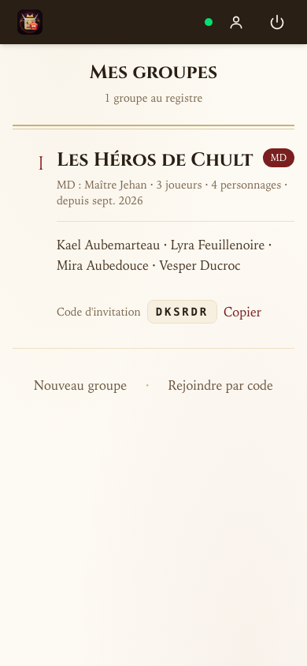

## ✨ Toutes les fonctionnalités

### 🎒 Inventaire & équipement
- **646 objets** du SRD 5e (catalogue consultable, recherche instantanée)
- Poids en **kilogrammes** + encombrance par paliers avec effets sur la vitesse
- Emplacements de stockage (porté, montures, conteneurs avec poids propre)
- Bourse (PC/PA/PE/PO/PP) — l'argent pèse !
- Transfert d'objets entre personnages en temps réel
- **Puces de combat calculées** sur chaque arme : bonus d'attaque avec détail au clic (FOR/DEX + maîtrise + magique), dés de dégâts avec type en français, variante à deux mains, bonus magique ✨, ⚠ non qualifié — les **armes magiques** retrouvent leur arme de base depuis la description SRD

| Inventaire | Arme avec stats calculées |
|---|---|
| 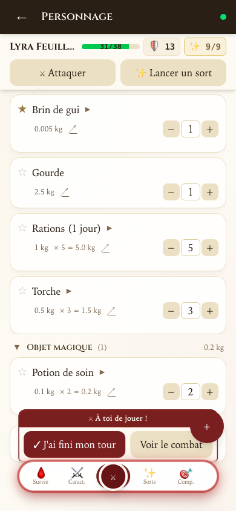 | 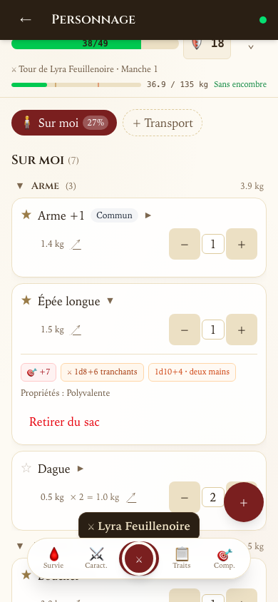 |

### 🩸 Survie & combat du personnage
- **Options d'attaque** : chaque arme équipée affichée avec ses jets (attaques ×2/×3/×4 pour les classes martiales, attaque furtive du Roublard, frappe sans arme avec dé d'arts martiaux du Moine)
- **PV** avec édition directe, dés de vie (compteur dépense/récupération), sauvegardes contre la mort à 0 PV
- **Concentration** : case à cocher ; si le joueur subit des dégâts (depuis sa fiche **ou** depuis le traqueur du MD), une notification lui demande un jet de Constitution DD 10 ou ½ dégâts ; les états incapacitants et les 0 PV rompent automatiquement la concentration
- Épuisement 1–6, 16 états SRD avec durées, inspiration, ration/eau (survie Chult)
- **Forme sauvage** (Druide) : formes selon DD et vol/nage par niveau, liste limitée aux **bêtes déjà vues** (👁), PV tirés aux dés, bloc de stats consultable, barre de PV de la forme intégrée au traqueur, retour auto avec dégâts excédentaires

| Attaques & PV | Forme sauvage |
|---|---|
| 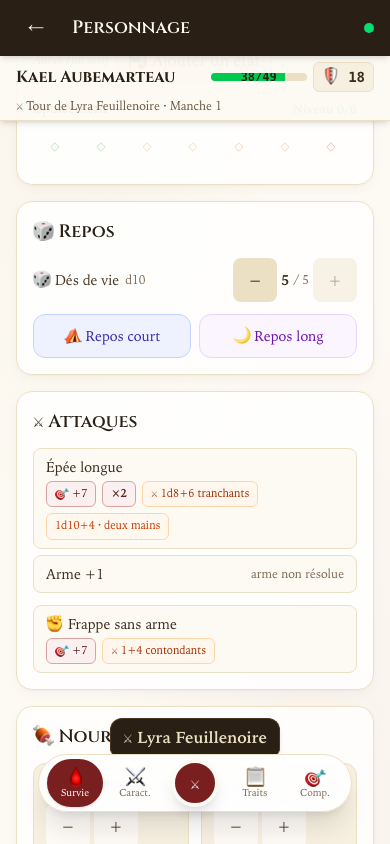 | 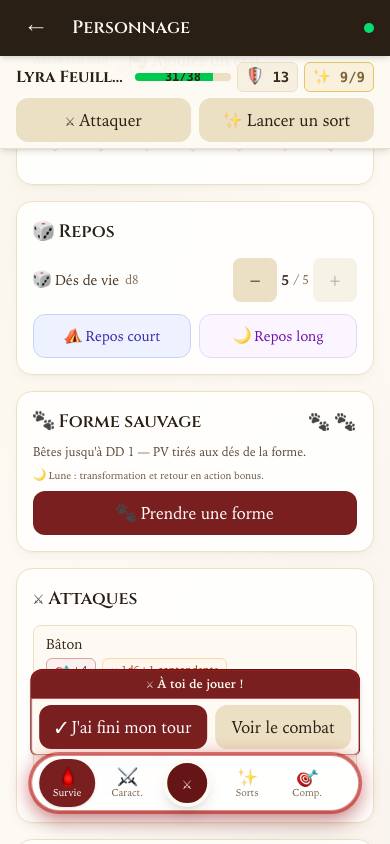 |

### ✨ Sorts
- **490 sorts** SRD + extensions (Xanathar/Tasha/Fizban), tout en français (AideDD)
- Traqueur d'emplacements par classe/niveau (grimoire complet, pacte, demi-magie, artificier)
- **Lancement de sort** : choix de l'emplacement, **incantation supérieure** (tous les niveaux disponibles avec dégâts mis à l'échelle affichés en direct), rituel sans emplacement, gestion de la concentration
- **Sorts toujours préparés** : domaine divin du Clerc, terrain du Cercle de la Terre du Druide, serment du Paladin — fusionnés dans la liste avec le marqueur ◆, hors quota de préparation
- Aperçu des dés au niveau choisi : dégâts ⚔ orange, **soins ✚ verts** (dés + modificateur de caractéristique pour Soins, Mot de guérison…), DD de sauvegarde et bonus d'attaque

| Grimoire | Lancer (incantation supérieure) |
|---|---|
| 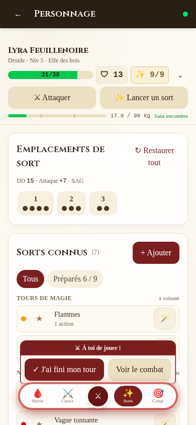 | 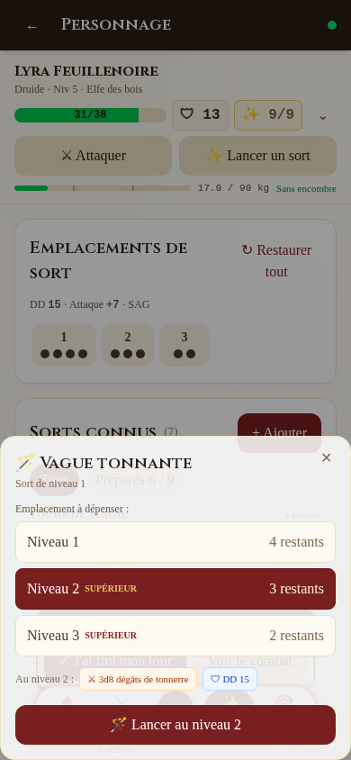 |

### 🔀 Multiclassage (SRD 5.1)
- **Feuille guidée « ＋ Ajouter une classe »** : carte des prérequis de caractéristiques (⚠ jamais bloquant), maîtrises acquises selon la table SRD, sous-classe verrouillée jusqu'à son palier RAW
- **Emplacements : deux pools** quand l'Occultiste s'y mêle — Incantation (table de l'incantateur multiclassé) et **magie de pacte** en or (recharge au repos court), interchangeables (SRD)
- **Sorts à classe d'origine** : DD et bonus d'attaque par classe incantatrice, compteurs de préparation par classe (chacune comme si mono-classe)
- **Dés de vie par type de dé** (5d10 + 3d8), dépense au repos court et budget de récupération au repos long
- Règles au niveau de CLASSE : attaque supplémentaire non cumulative (max), attaque sournoise, dés d'arts martiaux, aura du Paladin, critique amélioré du Champion, prérequis, expertise cumulée

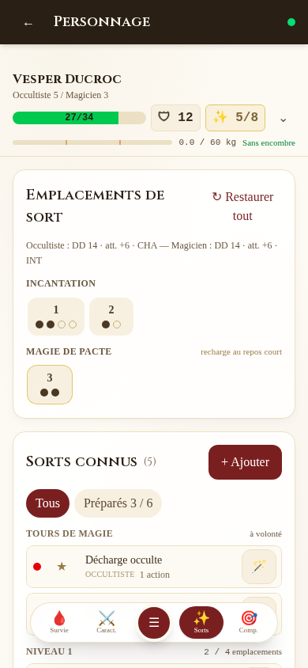

### ⚔️ Caractéristiques & règles de classe
- 6 scores, classe/niveau/race/historique, **sous-classes** (cercle druidique + terrain, domaine divin, serment sacré, archétypes), style de combat par classe
- **CA calculée** : type d'armure réel (légère/intermédiaire/lourde), boucliers, **armures magiques** résolues depuis la description, défense sans armure du Barbare (10+DEX+CON) et du Moine (10+DEX+SAG), style Défense
- **Vitesse** avec Déplacement sans armure (Moine), Déplacement rapide (Barbare), pénalité d'armure lourde sous la FOR minimale
- **Maîtrise d'armes** éditable (armes simples/de guerre/spécifiques par classe)
- 18 compétences + 6 jets de sauvegarde (2 colonnes), bonus de maîtrise

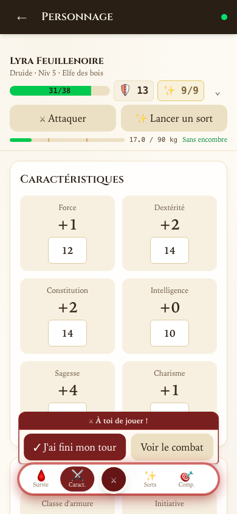

### 🗡️ Traqueur de combat (MD)
- **Rencontres** : monstres du bestiaire **964 bêtes**, groupés par type avec initiative partagée, **PV tirés aux dés de vie**
- Ajout des PJ en un clic, initiative saisie par les joueurs depuis leur écran
- **Démarrage en un clic**, avancement des tours (groupes sautés ensemble), tours et rounds
- Dégâts / soins / demi-dégâts / vaincu, édition directe PV/CA, couleurs de cartes
- **16 états avec durées** qui expirent automatiquement en fin de tour (et se synchronisent avec la fiche du joueur)
- **Blocs de stats complets** : capacités, actions avec **dés cliquables** (attaque d20, dégâts doublés sur critique), sorts des monstres consultables
- **PV synchronisés dans les deux sens** entre le traqueur du MD et la fiche du joueur

| Table du MD | Traqueur de combat | Bloc de stats |
|---|---|---|
| 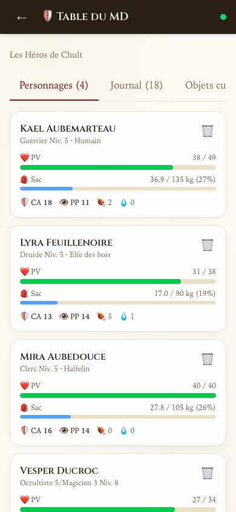 | 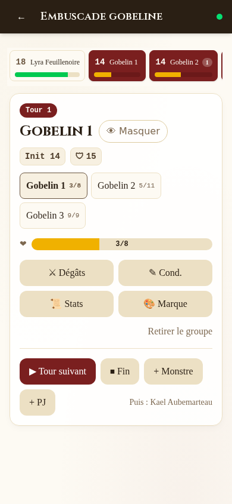 | 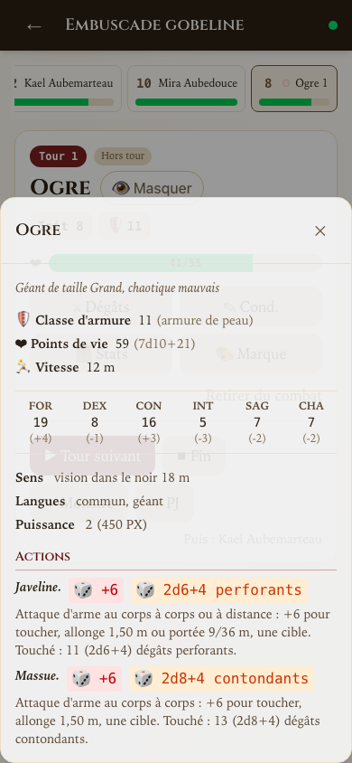 |

### 🔄 Temps réel & multi-appareils
- **Synchronisation WebSocket** : tout le monde voit les mêmes PV, états, initiative, en direct — le MD blesse, la fiche du joueur suit ; le joueur se soigne, le traqueur suit
- Notifications poussées : demande d'initiative, jet de concentration, tour du joueur (widget flottant)
- **Notifications Web Push** hors app (écran éteint, app fermée) : abonnement par appareil depuis Mon compte, chaîne VAPID complète côté serveur ([docs](docs/push-notifications.md)) — requiert un accès HTTPS
- PNJ partagés avec secrets réservés au MD, notes par personnage, traits avec compteurs (Rage, Divinité…)
- Installable comme **PWA** sur téléphone/tablette

| Widget de combat (joueur) | Formes (bêtes vues) |
|---|---|
| 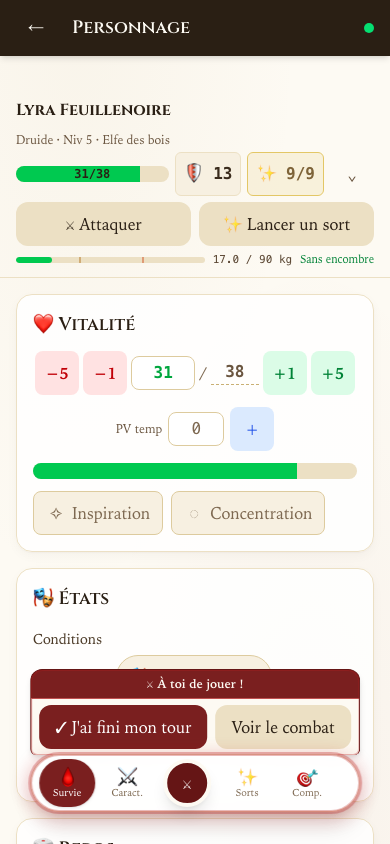 | 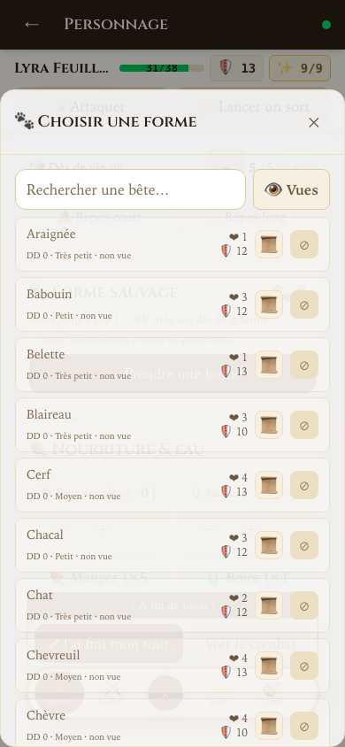 |

### ✉️ Correspondance secrète MD ↔ joueur
- **Un fil par personnage** : le MD échange en privé avec chaque joueur — indices, secrets, révélations que la table ne doit pas entendre. L'historique reste sur le fil ; seul le MD peut rayer une ligne, d'un geste confirmé
- **Visible partout** : un message qui arrive tombe en bannière où que le joueur se trouve, une pastille compte les non-lus — et devient une **notification Web Push** si l'app est fermée (le texte n'apparaît jamais sur l'écran de verrouillage)
- **Boîte de réception MD** : chaque personnage est un volume du registre — qui attend une réponse se lit en pastille, la plus fraîche correspondance tient l'ordinal sang

| Le fil (joueur) | Bannière d'arrivée | Boîte du MD |
|---|---|---|
| 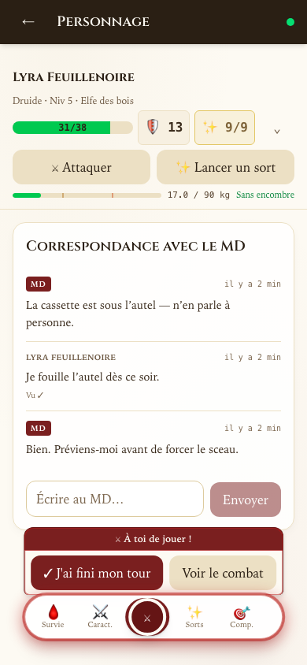 | 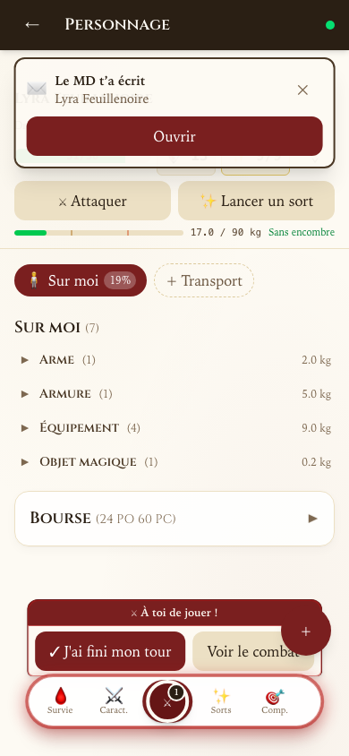 | 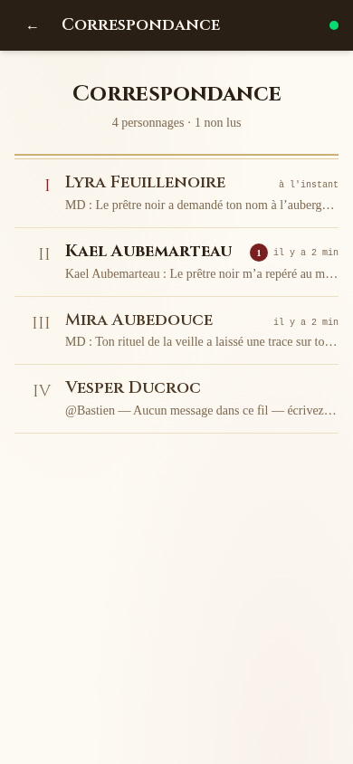 |

### 🎓 Visite guidée embarquée
- **La fiche s'explique toute seule** : à la première ouverture, un spotlight accueille le joueur (bandeau d'état, onglets, bouton central) — puis chaque onglet joue sa propre visite au premier passage
- **Rejouable à volonté** depuis « Mon compte → Réinitialiser le tutoriel » ; scripts français et anglais, bulle maison dans le monde parchemin/encre

| Bienvenue | Le bouton central |
|---|---|
| 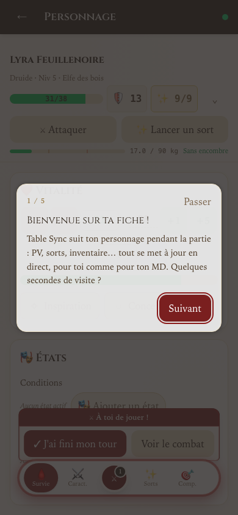 | 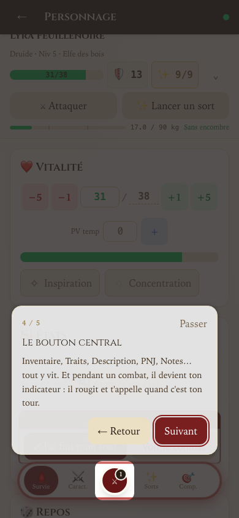 |

### 📜 GM Assistant — chronique de campagne
- **Liaison groupe ↔ campagne** [gmassistant.app](https://gmassistant.app) : le MD connecte sa clé API (chiffrée côté serveur, jamais dans le navigateur), relie une campagne existante ou la **crée depuis le groupe** — campagne D&D 5e + les personnages cochés avec leur « joué par » et leur fiche d'identité
- **Resynchronisation des personnages** à la demande : créations cochables, mises à jour nom / joué par / fiche d'identité (classes, alignement, apparence, personnalité, histoire), orphelins supprimés d'un geste confirmé — lecture seule partout ailleurs
- **Chronique** (📜 en annexes, ouverte à toute la table) : registre des séances — ordinaux romains = numéros de séance, la dernière en entrée courante — résumés multi-styles (Résumé, En bref, Héraut, Conte, Ironique, Sonnet…) et **moments mémorables enluminés par type** (⚔ épique gravé en or, 🕯 tragique en italique éteint, 🗝 intrigant à la clé…)
- **Cache serveur** (TTL 5 min, rafraîchissement MD, event temps réel) : une panne GM Assistant n'affiche jamais d'écran d'erreur au joueur — la chronique sert son dernier cachet, honnêtement marqué

| Onglet GM Assistant (MD) | Registre des séances | Moments enluminés |
|---|---|---|
| 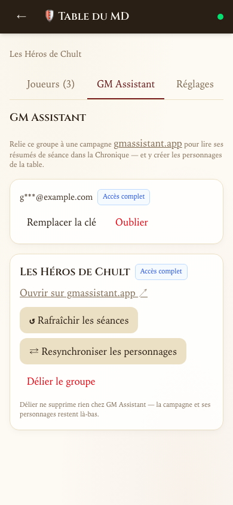 |  | 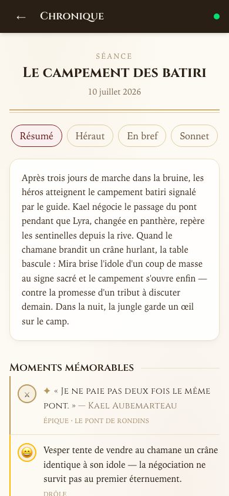 |

## 🚀 Démarrage

```bash
npm install                 # dépendances (workspaces)
npm run dev                 # API :4000 + Web :5173
docker compose up --build   # API :4010 + Web :8080
```

Le serveur auto-migre et sème la base au démarrage : 646 objets, 490 sorts, 964 monstres.

## 🧱 Architecture

- `apps/api` — Fastify 5 + better-sqlite3 (WebSocket `/ws`, JWT)
- `apps/web` — React 19 + Vite + Tailwind v4 (mobile-first, PWA)
- `packages/shared` — **moteur de règles SRD** partagé (CA, armes, vitesse, sorts, forme sauvage) + types
- `data/` — seeds JSON + SQLite
- Tests : suites de règles (`npm run test-weapon-stats`, `test-armor-stats`, `test-skill-stats`, `test-class-features`, `test-creation-data`) + intégration API (`npm run test-api`) + E2E navigateur Playwright (`npm run test:e2e`, stack jetable dédiée)

## 🧹 Lint & format (Biome)

[Biome](https://biomejs.dev) gère le linter **et** le formateur du monorepo (config : `biome.jsonc` — 2 espaces, simples quotes, LF, imports triés).

```bash
npm run lint       # vérifie lint + format (CI)
npm run lint:fix   # corrige et formate tout
npm run format     # formate uniquement
```

Sous VS Code : l'extension `biomejs.biome` formate à la sauvegarde (réglages dans `.vscode/`, non versionnés).

## ✅ CI

À chaque PR et push sur `main`, [ci-test.yml](.github/workflows/ci-test.yml) exécute le lint Biome, le typecheck (`tsc -b`, web + shared), les 6 suites de règles, la suite d'intégration API (avec sa porte « zéro SQL brut » : aucune requête hors Drizzle) et, en job parallèle, la suite E2E Playwright (`npm run test:e2e` — API + vite jetables sur base neuve, jamais les bases dev/Docker).

## 📜 Licence & données

Objets/monstres du SRD 5.1 (usage personnel, pas de revente). Traductions françaises de [5e-drs.fr](https://5e-drs.fr) et [AideDD.org](https://www.aidedd.org).
